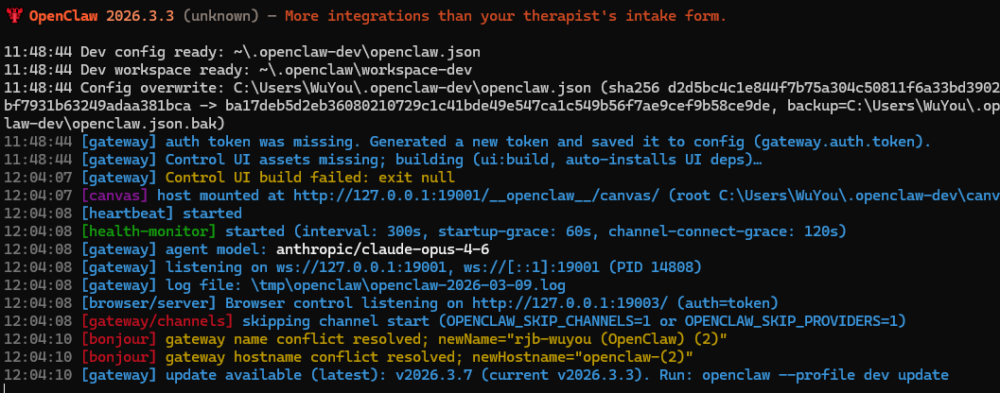
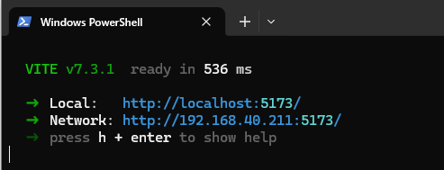
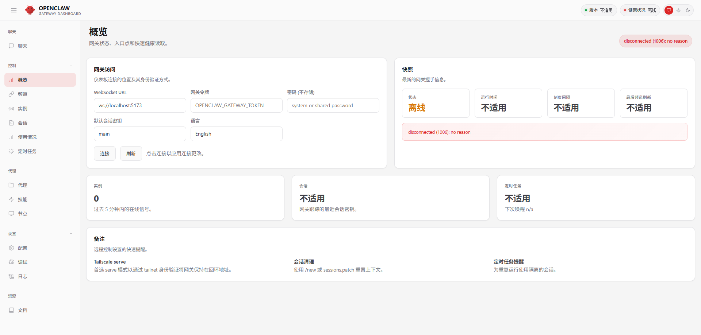
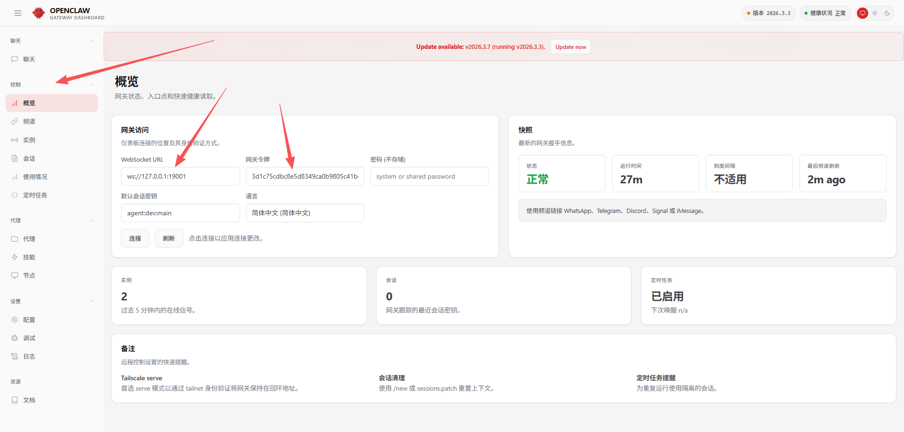

# OpenClaw 插件开发教程

本文档介绍如何在本地运行 OpenClaw 项目，为后续插件开发做准备。

## 环境要求

- Node.js
- pnpm
- Git

## 1. 项目启动

### 1.1 下载代码

从 GitHub 克隆项目代码：

```bash
git clone <openclaw-repo-url>
cd openclaw
```

### 1.2 安装依赖

```bash
pnpm install
```

### 1.3 安装 cross-env（Windows 必需）

由于 Windows 环境不兼容 Unix 风格的环境变量设置，需要安装 `cross-env`：

```bash
pnpm add -Dw cross-env
```

### 1.4 修改 package.json

找到 `scripts` 中的 `gateway:dev` 命令：

```json
"gateway:dev": "OPENCLAW_SKIP_CHANNELS=1 CLAWDBOT_SKIP_CHANNELS=1 node scripts/run-node.mjs --dev gateway"
```

修改为（在命令前添加 `cross-env`）：

```json
"gateway:dev": "cross-env OPENCLAW_SKIP_CHANNELS=1 CLAWDBOT_SKIP_CHANNELS=1 node scripts/run-node.mjs --dev gateway"
```

### 1.5 启动 Gateway 服务

```bash
pnpm gateway:dev
```

> **注意**: 首次运行会自动构建 UI，需要等待较长时间。
>
> ```
> 11:48:44 [gateway] auth token was missing. Generated a new token and saved it to config (gateway.auth.token).
> 11:48:44 [gateway] Control UI assets missing; building (ui:build, auto-installs UI deps)…
> ```

你也可以提前编译 UI 来节省时间：

```bash
pnpm ui:build
```

启动成功后界面如下：



### 1.6 启动 UI 开发服务器

新开一个终端窗口，运行：

```bash
pnpm ui:dev
```



### 1.7 访问控制面板

浏览器访问：http://localhost:5173/overview

此时页面显示离线状态，因为没有配置认证令牌：



### 1.8 获取并配置令牌

令牌存储在用户目录下的配置文件中：

**Windows**: `C:\Users\<用户名>\.openclaw-dev\openclaw.json`

**macOS/Linux**: `~/.openclaw-dev/openclaw.json`

打开配置文件，找到 `gateway.auth.token` 字段：

```json
{
  "meta": {
    "lastTouchedVersion": "2026.3.3",
    "lastTouchedAt": "2026-03-09T03:48:44.088Z"
  },
  "agents": {
    "defaults": {
      "workspace": "C:\\Users\\WuYou\\.openclaw\\workspace-dev",
      "skipBootstrap": true,
      "compaction": {
        "mode": "safeguard"
      }
    },
    "list": [
      {
        "id": "dev",
        "default": true,
        "workspace": "C:\\Users\\WuYou\\.openclaw\\workspace-dev",
        "identity": {
          "name": "C3-PO",
          "theme": "protocol droid",
          "emoji": "🤖"
        }
      }
    ]
  },
  "commands": {
    "native": "auto",
    "nativeSkills": "auto",
    "restart": true,
    "ownerDisplay": "raw"
  },
  "gateway": {
    "mode": "local",
    "bind": "loopback",
    "auth": {
      "mode": "token",
      "token": "3d1c75cdbc8e5d8349ca0b9805c41bd26188071858c0696b"
    }
  }
}
```

### 1.9 填写令牌

将获取到的 token 填入控制面板：



## 2. 大模型配置

### 2.1 启动配置向导

```bash
pnpm openclaw onboard
```

### 2.2 选择模型提供商

按照提示操作：

1. 选择 `Yes`
2. 选择 `QuickStart`
3. 选择你的模型提供商（如 Z.AI 智谱）

## 3. 常见问题

### Windows 环境变量报错

**错误信息**：

```
pnpm gateway:dev
> openclaw@2026.3.3 gateway:dev E:\py_project\openclaw-main
> OPENCLAW_SKIP_CHANNELS=1 CLAWDBOT_SKIP_CHANNELS=1 node scripts/run-node.mjs --dev gateway
'OPENCLAW_SKIP_CHANNELS' 不是内部或外部命令，也不是可运行的程序或批处理文件。
ELIFECYCLE Command failed with exit code 1.
```

**原因**：Windows 不支持 Unix 风格的环境变量设置语法。

**解决方案**：按照 [1.3](#13-安装-cross-envwindows-必需) 和 [1.4](#14-修改-packagejson) 步骤安装并配置 `cross-env`。

## 下一步

环境配置完成后，你可以开始开发插件了。请参考后续文档了解插件开发的具体流程。
